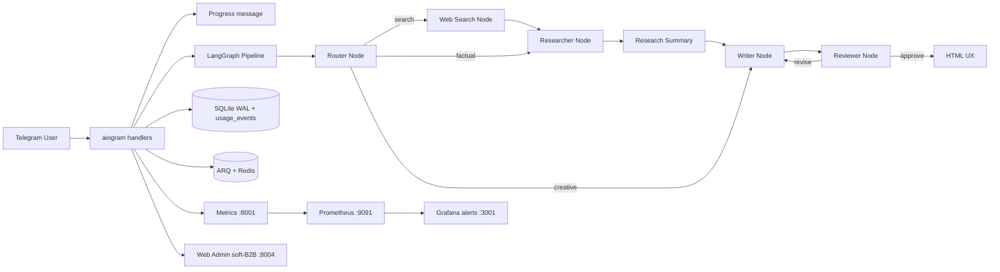

# Watchdog Bot

[](https://www.python.org/downloads/)
[](https://github.com/langchain-ai/langgraph)
[](https://docs.aiogram.dev/)
[](https://www.docker.com/)
[](LICENSE)

**Self-hosted AI assistant with a multi-agent LangGraph pipeline and live web search**

## О проекте

**Watchdog Bot** — portfolio-ready MVP Telegram-ассистента: оркестрация через LangGraph,
умный роутер запросов, живой веб-поиск (Tavily), прогресс-индикаторы в Telegram,
переключение LLM OpenAI ↔ DeepSeek, память диалогов на SQLite (WAL), фоновые задачи ARQ/Redis,
RBAC, Prometheus/Grafana с алертами владельцу и soft-B2B FastAPI-админка (usage, export, soft-delete).

### Что умеет

- Multi-agent research: Router → (Web Search?) → Researcher → Summary → Writer → Reviewer
- Экономия токенов за счёт Smart Router (креатив без Tavily)
- Продуктовый UX в Telegram: Draft → Research summary → Sources + живой progress
- Учёт токенов/оценки стоимости запроса (Prometheus + `usage_events` по пользователям)
- Фоновые тяжёлые задачи (ARQ), self-diagnostics, RBAC owner/admin/user
- Admin: статистика usage, экспорт диалогов JSON/CSV, soft-delete + retention purge
- Grafana-алерты владельцу: error rate, queue lag, LLM fallback

### Чего не умеет (честный scope)

- Не multi-tenant SaaS и не enterprise IAM (SSO/SAML)
- Не Postgres / горизонтальный шардинг — одна SQLite на инстанс
- Не биллинг-шлюз и не прайс-лист в репозитории
- Не гарантированный SLA / on-call платформа «из коробки»
- Anchors: read API есть; write path в Telegram UX пока reserved

Это **не** enterprise B2B-платформа «из коробки». Это честный self-hosted каркас для демо и портфолио,
который можно развивать (Postgres, tenancy, CI — вне текущего scope).

Операции: см. [docs/RUNBOOK.md](docs/RUNBOOK.md).

## Быстрый старт

```bash
git clone https://github.com/kartuznik/watchdog_bot.git
cd watchdog_bot
cp .env.example .env
# заполните TELEGRAM_BOT_TOKEN, OPENAI_API_KEY (или DeepSeek), OWNER_ID,
# ADMIN_PASSWORD, TELEGRAM_ALERT_CHAT_ID (обычно = OWNER_ID)
docker compose up -d --build
```

## Возможности

- **Smart Router**: лёгкий классификатор решает, нужен ли Tavily (экономия токенов на стихах/терминах).
- **Progress UX**: одно сервисное сообщение со стадиями («Ищу источники…» → «Формирую ответ…»), затем удаляется.
- **Multi-agent reasoning**: Router → (Web Search?) → Researcher → Summary → Writer → Reviewer.
- **Product Telegram UX**: HTML-ответы; порядок Draft → Research summary → Sources (кликабельные якоря + кнопки).
- **Tavily web search**: только когда router выбрал search; иначе внутренние знания / Writer.
- **Usage & cost accounting**: `usage_events` на каждый завершённый запрос (sync + ARQ) + Prometheus counters.
- **Conversation memory**: SQLite с `WAL` + soft-delete / retention (`DATA_RETENTION_DAYS`, default 90).
- **Background worker**: тяжёлые запросы уходят в ARQ вместе с `conversation_history`.
- **Self-diagnostics**: health-check + monitor-agent (флаг `self_diagnostics`).
- **RBAC + observability**: metrics `:8011`, Prometheus `:9091`, Grafana `:3001` (+ Telegram alerts), admin `:8004`.

## Архитектура



## Smart Router и экономия токенов

Перед тяжёлым пайплайном `router_node` классифицирует запрос (LLM JSON + heuristic fallback):

| Решение | Когда | Путь |
|---|---|---|
| `no_search` + creative | стих, шутка, перевод | сразу Writer → Reviewer |
| `no_search` + factual | «что такое…», объясни термин | Research → Summary → Writer (без Tavily) |
| `search` | новости, актуальность, сравнения | Web Search → Research → … |

Метрика: `agent_router_decisions_total{decision="search"|"no_search"}`.

Каждый завершённый запрос пишет строку в `usage_events` (tokens + estimated cost + router decision)
для admin-агрегации по пользователям — и в sync-пути, и в ARQ worker.

## Progress indicators (живой UX)

Пока граф работает 10–30 секунд, бот обновляет **одно** сервисное сообщение:

1. 🧭 Определяю маршрут…
2. 🔎 Ищу источники… *(только если router выбрал search)*
3. 🧠 Анализирую данные…
4. ✍️ Формирую ответ…
5. 🧪 Проверяю качество…

Синхронный путь: `graph.astream(..., stream_mode="updates")`.  
Фоновый ARQ: колонка `async_tasks.stage` + `progress_message_id`, poller редактирует то же сообщение.  
Повторный `edit` при том же stage не отправляется; ошибки Telegram при delete/edit не роняют бота.

## Продуктовый формат ответов

1. **📝 Ответ** (draft) — HTML, без markdown-решёток и без вшитых ссылок.
2. **🔬 Кратко по исследованию** — саммари 3–5 пунктов (`research_summary`, ≤800 символов).
3. **🔗 Источники** — кликабельные HTML-якоря + inline-кнопки; превью ссылок отключены.

Технический футер (итерации / tokens / cost estimate) виден только **admin** и **owner**.

## Демо

Скриншоты и GIF добавляются Архитектором в [`docs/demo/`](docs/demo/):

| Плейсхолдер | Сценарий |
|---|---|
| `docs/demo/01-router-creative.png` | Креатив без поиска + progress |
| `docs/demo/02-search-sources.png` | Факт/поиск + Sources |
| `docs/demo/03-progress.gif` | Живые стадии одного сообщения |
| `docs/demo/04-admin-usage.png` | Admin usage / Export / Soft-delete |
| `docs/demo/05-grafana-overview.png` | Grafana overview + alerts |

Пока файлов нет — см. [docs/demo/README.md](docs/demo/README.md).

## Soft-B2B admin

HTTP Basic (`admin` + `ADMIN_PASSWORD`), порт `:8004`:

| Endpoint | Назначение |
|---|---|
| `GET /api/usage` | Агрегаты requests/tokens/cost по пользователям |
| `GET /api/export/dialogs?format=json\|csv` | Экспорт диалогов |
| `POST /api/users/{id}/soft_delete` | Мягкое удаление пользователя и диалогов |
| `POST /api/clear_memory` | Soft-clear по умолчанию (`hard=true` — жёстко) |
| `POST /api/retention/purge` | Hard-purge по `DATA_RETENTION_DAYS` |

Опция `SOFT_DELETE_GATE=true` блокирует soft-deleted пользователей в боте (**выключена по умолчанию**).

## Команды Telegram

| Команда | Назначение | Доступ |
|---|---|---|
| `/start` | Приветствие | user |
| `/research <тема>` | Multi-agent исследование | user |
| `/clear` | Soft-clear истории диалога | user |
| `/me` | Показать свою роль | user |
| `/selftest` | Быстрая проверка подсистем | admin |
| `/status` | Техсостояние процесса | admin |
| `/fulldiag` | Полная диагностика monitor-agent | admin |
| `/setadmin <user_id>` | Выдать admin | owner |
| `/removeadmin <user_id>` | Снять admin | owner |
| `/admins` | Список админов | owner |
| `/restart` | Перезапуск процесса бота | owner |

Обычный текст без `/` также запускает research-flow.

## Feature flags

| Flag | Эффект |
|---|---|
| `self_diagnostics` | health-check + monitor loop |
| `background_worker` | enqueue тяжёлых запросов в ARQ |
| `web_search` | Tavily/TG search node |

```bash
ENABLED_MODULES=self_diagnostics,background_worker,web_search
```

## Переменные окружения

| Переменная | Обязательность | Описание |
|---|---|---|
| `TELEGRAM_BOT_TOKEN` | обязательно | токен BotFather |
| `OWNER_ID` | рекомендуется | Telegram user id владельца |
| `TELEGRAM_ALERT_CHAT_ID` | рекомендуется | chat id для Grafana Telegram alerts |
| `OPENAI_API_KEY` / `DEEPSEEK_API_KEY` | обязательно для выбранного провайдера | ключ LLM |
| `LLM_PROVIDER` | опционально | `openai` (default) или `deepseek` |
| `MODEL_NAME` | опционально | например `gpt-4o-mini` / `deepseek-chat` |
| `TAVILY_API_KEY` | рекомендуется | живой веб-поиск |
| `ADMIN_PASSWORD` | обязательно | Basic Auth для FastAPI admin |
| `REDIS_URL` | опционально | очередь ARQ |
| `AGENT_DB_PATH` | опционально | путь к SQLite |
| `DATA_RETENTION_DAYS` | опционально | retention soft-delete/usage (default 90) |
| `SOFT_DELETE_GATE` | опционально | блокировать soft-deleted users (default false) |
| `METRICS_PORT` | опционально | порт metrics внутри контейнера |
| `GRAFANA_ADMIN_PASSWORD` | опционально | пароль Grafana |
| `ENABLED_MODULES` | опционально | CSV override feature flags |

## Установка и деплой

### Docker (рекомендуется)

```bash
docker compose up -d --build
docker compose ps
pytest -q
```

Подробности, backup, ротация ключей и инциденты — в [docs/RUNBOOK.md](docs/RUNBOOK.md).

### Локально (без Docker)

```bash
python -m venv .venv
source .venv/bin/activate
pip install -r requirements.txt
python -m telegram_bot.main
```

## Мониторинг и алерты

- **Web Admin**: `:8004` (user `admin` + `ADMIN_PASSWORD`)
- **Bot metrics**: host `:8011` → container `:8001`
- **Prometheus**: `:9091`
- **Grafana**: `:3001` (contact point `telegram-owner` через env, без секретов в YAML)

Метрики:

- `agent_prompt_tokens_total` / `agent_completion_tokens_total`
- `agent_estimated_cost_usd_total`
- `agent_llm_fallback_total{from_provider,to_provider}`
- `agent_router_decisions_total{decision="search"|"no_search"}`
- `agent_async_queue_lag_seconds` (bot-side gauge из SQLite)

Grafana alert rules (пороги):

| Alert | Условие |
|---|---|
| HighErrorRate | error rate **> 5%** на окне **5m** |
| AsyncQueueLag | queue lag **> 300s** (5 минут) |
| LLMProviderFallback | `increase(fallback[10m]) > 0` |

Dashboard дополнен панелями cost / router / fallback / queue lag.

### Операционные заметки

- **Лимит Telegram 4096:** ответы уходят секциями; чанки ≤3500 по границам предложений.
- **Tavily:** нужен валидный `TAVILY_API_KEY`; секреты только в серверном `.env`.
- **LLM fallback:** при 401/402/403 / Insufficient Balance пробуется второй провайдер.

## Решение проблем

| Проблема | Причина | Решение |
|---|---|---|
| `TELEGRAM_BOT_TOKEN is not set` | пустой `.env` | заполните токен и перезапустите |
| `TelegramConflictError` | два polling на одном токене | оставьте один инстанс на токен |
| Нет источников / InvalidAPIKey Tavily | просроченный ключ | обновите `.env`, recreate `bot` `worker` |
| `message is too long` | ответ >4096 | чанкинг в коде; пересоберите bot |
| LLM 401/402/403 | ключ/баланс провайдера | fallback + проверка обоих ключей |
| `database is locked` | старый journal mode | WAL в `get_connection()` |
| `401` на админке | неверный пароль | `admin` + `ADMIN_PASSWORD` |
| Алерты молчат | нет `TELEGRAM_ALERT_CHAT_ID` | задайте chat id, recreate `grafana` |

## Разработка

- `agents/` — граф, LLM, search, memory, metrics, health
- `telegram_bot/` — aiogram handlers / middleware / progress
- `admin_panel/` — FastAPI soft-B2B admin
- `worker.py` — ARQ research worker
- `monitoring/` — Prometheus/Grafana (+ alerting provisioning)
- `docs/` — RUNBOOK + demo placeholders
- `tests/` — unit/integration tests

## Лицензирование и коммерческое использование

Базовая лицензия репозитория — **MIT** (см. [LICENSE](LICENSE)): код можно изучать, форкать и запускать self-hosted.

Коммерческие условия и редакции **Starter**, **Team** и **Custom** доступны **по запросу через контакт** (условия и коммерческие материалы — вне этого репозитория).

Кратко по составу возможностей (без коммерческих цифр):

| Редакция | Состав (ориентир) |
|---|---|
| **Community (MIT)** | Self-host бот, LangGraph + router/progress, SQLite, базовый admin, Prometheus/Grafana |
| **Starter** | То же + сопровождение внедрения single-tenant demo |
| **Team** | Soft-B2B admin (usage/export/retention), Grafana Telegram alerts, operational runbook |
| **Custom** | Индивидуальный scope: Postgres/tenancy/SSO/интеграции — обсуждается отдельно |

Конкретные коммерческие условия живут в презентациях и листингах **вне** git.

## FAQ

**Q: Это production-ready enterprise?**  
A: Нет. Portfolio-ready MVP / self-hosted assistant. Для полноценного B2B нужны Postgres, tenancy, TLS, CI.

**Q: Как снизить расход токенов?**  
A: Smart Router уже пропускает Tavily на креативе; выбирайте компактную модель (`MODEL_NAME`) или `LLM_PROVIDER=deepseek`; смотрите router/usage метрики.

**Q: Обязателен ли Tavily?**  
A: Нет. Без ключа бот работает на знаниях модели, без live sources.

## License

MIT — см. [LICENSE](LICENSE).
