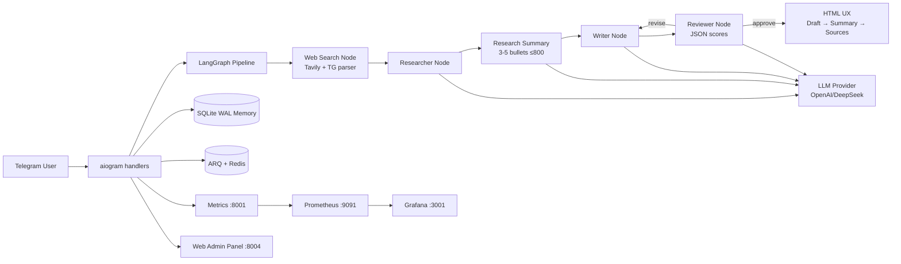

# Watchdog Bot

[](https://www.python.org/downloads/)
[](https://github.com/langchain-ai/langgraph)
[](https://docs.aiogram.dev/)
[](https://www.docker.com/)
[](LICENSE)

**Self-hosted AI assistant with a multi-agent LangGraph pipeline and live web search**

## О проекте

**Watchdog Bot** — portfolio-ready MVP Telegram-ассистента: оркестрация через LangGraph,
живой веб-поиск (Tavily), переключение LLM OpenAI ↔ DeepSeek, память диалогов на SQLite (WAL),
фоновые задачи ARQ/Redis, RBAC, Prometheus/Grafana и тонкая FastAPI-админка.

Это **не** enterprise B2B-платформа «из коробки». Это честный self-hosted каркас, который
можно показать в портфолио и развивать дальше (Postgres, tenancy, CI — вне текущего scope).

## Быстрый старт

```bash
git clone https://github.com/kartuznik/watchdog_bot.git
cd watchdog_bot
cp .env.example .env
# заполните TELEGRAM_BOT_TOKEN, OPENAI_API_KEY (или DeepSeek), OWNER_ID, ADMIN_PASSWORD
docker compose up -d --build
```

## Возможности

- **Multi-agent reasoning**: Web Search → Researcher → Summary → Writer → Reviewer (structured JSON scores).
- **Product Telegram UX**: HTML-ответы без сырых `#`-заголовков; порядок Draft → Research summary → Sources.
- **Tavily web search**: источники как нумерованный список + inline-кнопки (title → url).
- **LLM cost control**: `LLM_PROVIDER=openai|deepseek`, оценка токенов/стоимости в Prometheus (футер только admin/owner).
- **Conversation memory**: SQLite с `WAL` + `busy_timeout` для параллельной записи bot/worker/admin.
- **Background worker**: тяжёлые запросы уходят в ARQ вместе с `conversation_history`.
- **Self-diagnostics**: health-check + monitor-agent (включается флагом `self_diagnostics`).
- **RBAC + observability**: owner/admin/user, metrics `:8011`, Prometheus `:9091`, Grafana `:3001`, admin `:8004`.

## Архитектура



## Продуктовый формат ответов

Порядок сообщений в Telegram:

1. **📝 Ответ** (draft) — HTML, без markdown-решёток и без вшитых ссылок.
2. **🔬 Кратко по исследованию** — компактное саммари 3–5 пунктов из графа (`research_summary`, бюджет ≤800 символов, без обрезки слов).
3. **🔗 Источники** — нумерованный список названий + **inline-кнопки** с url.

Дополнительно:

- Чанкинг режет только по абзацам/предложениям; при переносе добавляется пометка «продолжение ниже».
- Технический футер (`итерации / tokens / cost`) виден только ролям **admin** и **owner** (RBAC).
- Пользовательский и LLM-текст экранируется через `html.escape` под `ParseMode.HTML`.

## Команды Telegram

| Команда | Назначение | Доступ |
|---|---|---|
| `/start` | Приветствие | user |
| `/research <тема>` | Multi-agent исследование | user |
| `/clear` | Очистить историю диалога | user |
| `/me` | Показать свою роль | user |
| `/selftest` | Быстрая проверка подсистем | admin |
| `/status` | Техсостояние процесса | admin |
| `/fulldiag` | Полная диагностика monitor-agent | admin |
| `/setadmin <user_id>` | Выдать admin | owner |
| `/removeadmin <user_id>` | Снять admin | owner |
| `/admins` | Список админов | owner |
| `/restart` | Перезапуск процесса бота | owner |

Обычный текст без `/` также запускает research-flow.

Web-админка доступна по HTTP (`:8004`), отдельной Telegram-команды `/admin` нет.

## Feature flags

Рабочие флаги (код реально проверяет их):

| Flag | Эффект |
|---|---|
| `self_diagnostics` | health-check + monitor loop |
| `background_worker` | enqueue тяжёлых запросов в ARQ |
| `web_search` | Tavily/TG search node |

Задаются списком в `config.py` или переопределяются env:

```bash
ENABLED_MODULES=self_diagnostics,background_worker,web_search
```

Admin panel / Prometheus / Grafana / RBAC всегда доступны через compose и код.

## Переменные окружения

| Переменная | Обязательность | Описание |
|---|---|---|
| `TELEGRAM_BOT_TOKEN` | обязательно | токен BotFather |
| `OWNER_ID` | рекомендуется | Telegram user id владельца |
| `OPENAI_API_KEY` / `DEEPSEEK_API_KEY` | обязательно для выбранного провайдера | ключ LLM |
| `LLM_PROVIDER` | опционально | `openai` (default) или `deepseek` |
| `MODEL_NAME` | опционально | например `gpt-4o-mini` / `deepseek-chat` |
| `TAVILY_API_KEY` | рекомендуется | живой веб-поиск |
| `ADMIN_PASSWORD` | обязательно | Basic Auth для FastAPI admin |
| `REDIS_URL` | опционально | очередь ARQ |
| `AGENT_DB_PATH` | опционально | путь к SQLite |
| `METRICS_PORT` | опционально | порт metrics внутри контейнера |
| `GRAFANA_ADMIN_PASSWORD` | опционально | пароль Grafana |
| `ENABLED_MODULES` | опционально | CSV override feature flags |

## Установка и деплой

### Docker (рекомендуется)

```bash
docker compose up -d --build
docker compose ps
pytest -q
```

### Локально (без Docker)

```bash
python -m venv .venv
source .venv/bin/activate
pip install -r requirements.txt
python -m telegram_bot.main
```

### VPS (Ubuntu)

1. Установите Docker и Docker Compose.
2. Разверните проект в `/opt/bots/watchdog_bot`.
3. Заполните `.env`.
4. `docker compose up -d --build`.
5. Проверьте `docker compose logs --tail=100 bot`.

## Мониторинг

- **Web Admin**: `http://<host>:8004` (user `admin` + `ADMIN_PASSWORD`)
- **Bot metrics**: host port `8011` → container `:8001`
- **Prometheus**: `http://<host>:9091`
- **Grafana**: `http://<host>:3001`

Метрики токенов/стоимости/fallback:

- `agent_prompt_tokens_total`
- `agent_completion_tokens_total`
- `agent_estimated_cost_usd_total`
- `agent_llm_fallback_total{from_provider,to_provider}`

### Операционные заметки

- **Лимит Telegram 4096:** ответ уходит продуктовыми секциями (Draft → Summary → Sources), чанки ≤3500 по границам предложений.
- **Tavily:** нужен *валидный* `TAVILY_API_KEY`. Невалидный ключ даёт soft-fail поиска и честное предупреждение пользователю; секреты в git не коммитятся (только серверный `.env`).
- **LLM fallback:** при 401/402/403 или `Insufficient Balance` бот автоматически пробует второй провайдер (OpenAI ↔ DeepSeek), пишет лог и инкрементирует `agent_llm_fallback_total`.

## Решение проблем

| Проблема | Причина | Решение |
|---|---|---|
| `TELEGRAM_BOT_TOKEN is not set` | пустой `.env` | заполните токен и перезапустите |
| `TelegramConflictError` | два polling на одном токене | оставьте один инстанс на токен |
| Нет источников / InvalidAPIKey Tavily | просроченный/`bad` `TAVILY_API_KEY` | обновите ключ в серверном `.env`, `docker compose up -d --build bot worker` |
| `message is too long` | ответ >4096 | обновлённый код шлёт чанки; пересоберите bot |
| LLM 401/402/403 / Insufficient Balance | ключ/баланс провайдера | пополните баланс или положитесь на fallback; проверьте оба ключа |
| Worker без контекста | старая версия | обновите: history передаётся в ARQ |
| `database is locked` | старый journal mode | WAL включён в `get_connection()` — перезапустите сервисы |
| `401` на админке | неверный пароль | `admin` + `ADMIN_PASSWORD` |

## Разработка

- `agents/` — граф, LLM, search, memory, health
- `telegram_bot/` — aiogram handlers / middleware
- `admin_panel/` — FastAPI admin
- `worker.py` — ARQ research worker
- `monitoring/` — Prometheus/Grafana
- `tests/` — unit/integration tests

Anchors: read API доступен в admin panel; write path reserved (без Telegram UX в этой версии).

## FAQ

**Q: Это production-ready enterprise?**  
A: Нет. Это portfolio-ready MVP / self-hosted assistant. Для B2B нужны Postgres, tenancy, TLS, CI.

**Q: Как снизить стоимость?**  
A: `LLM_PROVIDER=deepseek` или держите `MODEL_NAME=gpt-4o-mini`; смотрите `agent_estimated_cost_usd_total`.

**Q: Обязателен ли Tavily?**  
A: Нет. Без ключа бот работает на знаниях модели, без live sources.

## License

MIT — см. [LICENSE](LICENSE).
